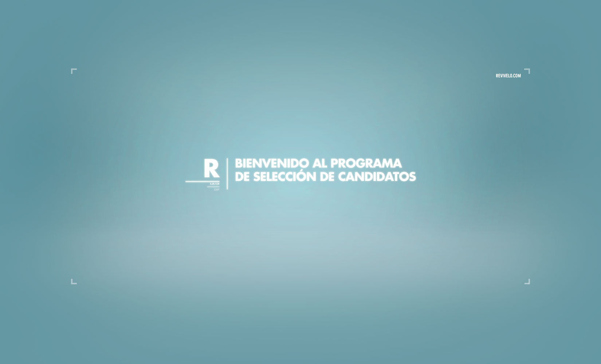
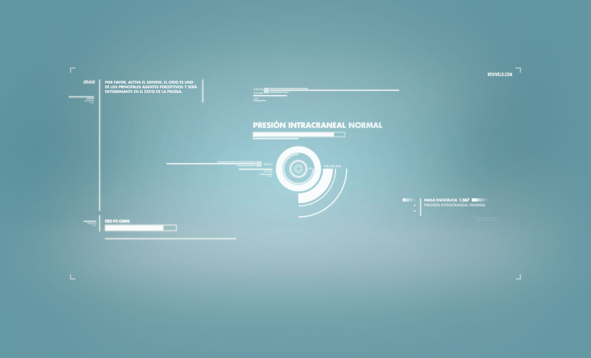
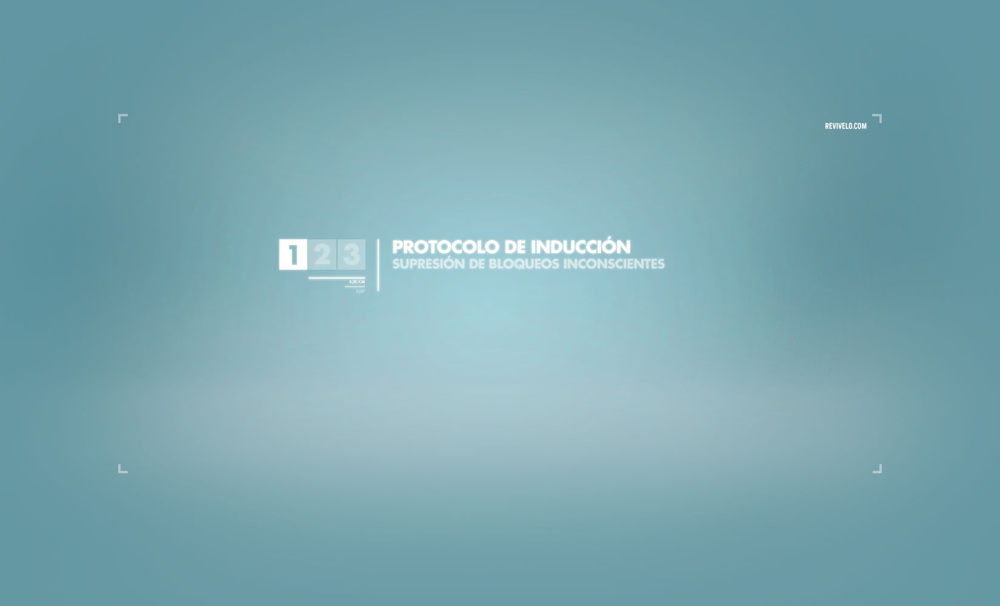
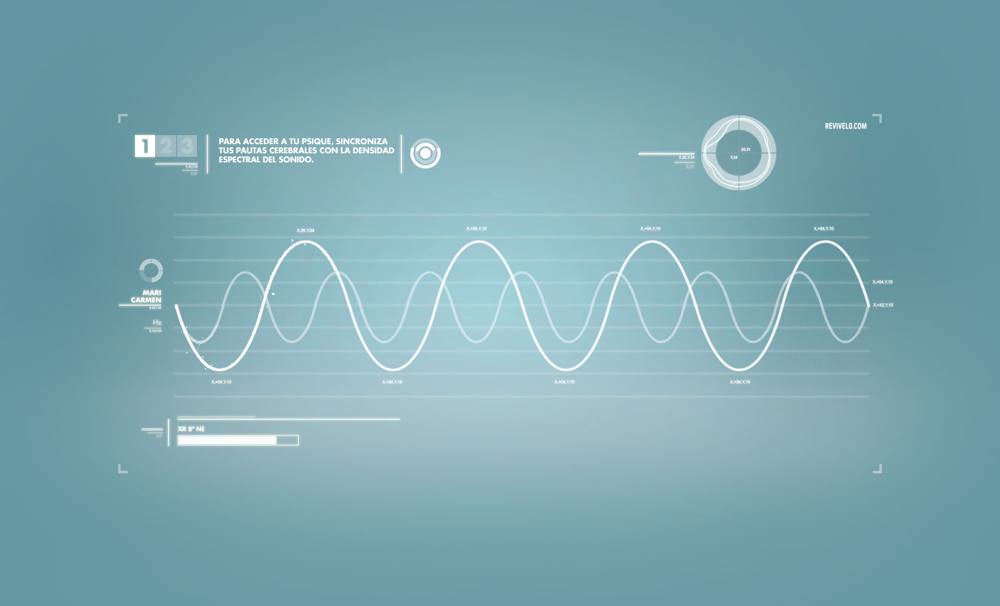
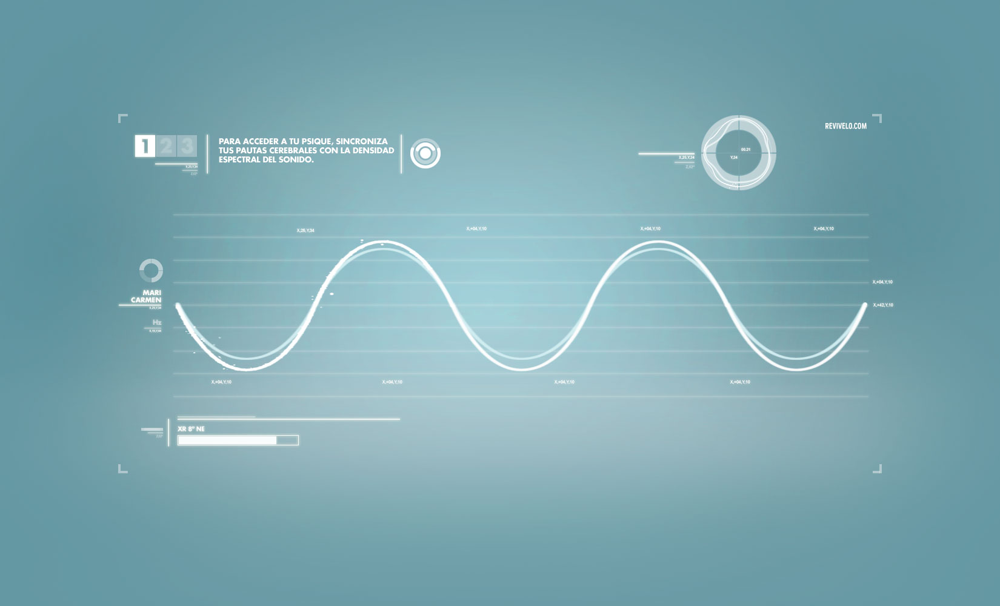
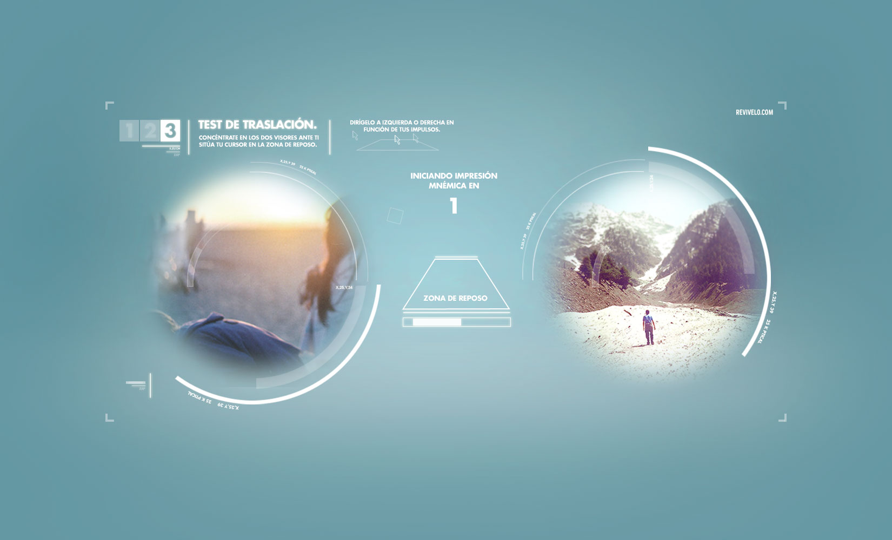

There was a time when we used to build web experience that were like small games, in the sense that were so complex and the user could potentially be there for 10 or 15 minutes.
But that is not possible anymore, you can not retain a user for more than few seconds. You have to say what you have to say in an instant.

But this project was made in 2011, when getting content from Facebook through the API was our most common task, and I enjoyed a lot making Flash experiences with lot of animations and complex mechanics.

**Rev&iacute;velo** was a lot of that, a fine production with a lot of detail.

<iframe src="//www.youtube.com/embed/tJBfbUN1dvY?rel=0&amp;showinfo=0&amp;vq=hd1080" frameborder="0" allowfullscreen></iframe>

<ul class="screen-shots">
    <li></li>
    <li></li>
    <li></li>
    <li></li>
    <li></li>
    <li></li>
</ul>
